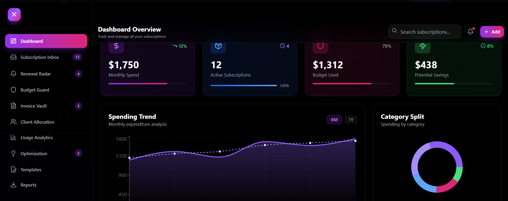
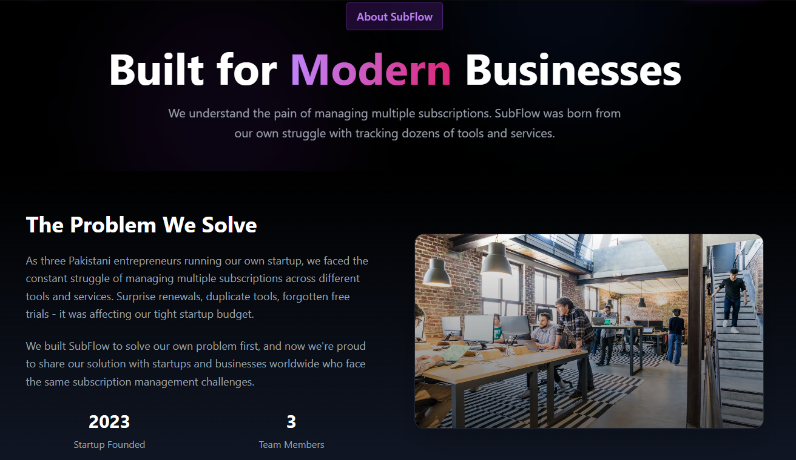
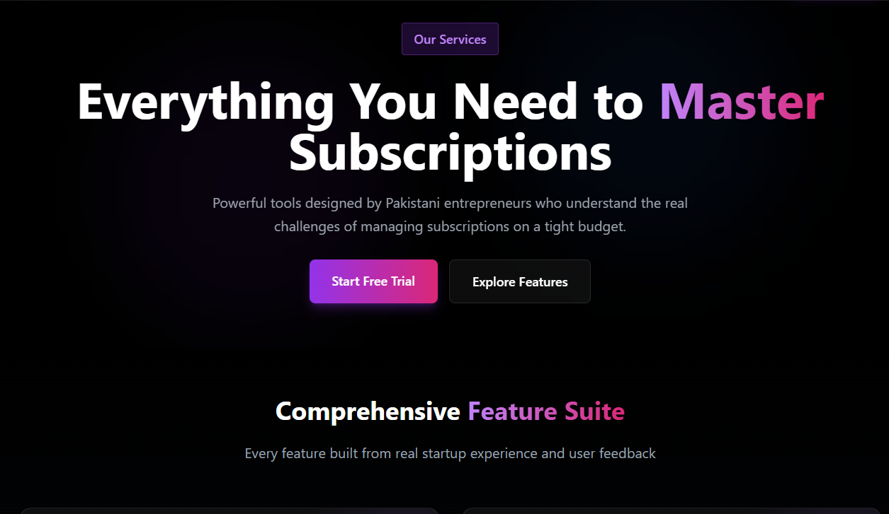
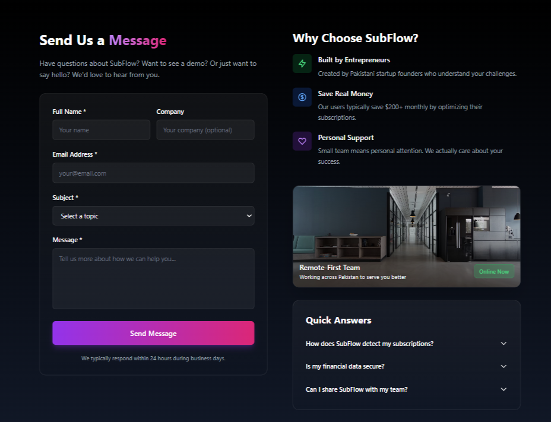
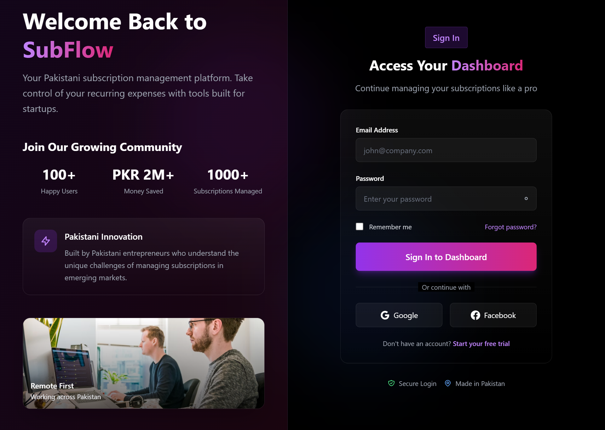

# 📊 Subscription Management Platform for Freelancers

A modern SaaS dashboard that helps **freelancers** manage all their tool subscriptions in one place — from tracking expenses to receiving renewal alerts and managing invoices.  
The platform provides a clean, centralized interface to stay on top of every recurring payment, ensuring that no renewal or expense goes unnoticed.

---

## 🧭 Overview

Freelancers use dozens of online tools — design platforms, writing assistants, analytics dashboards, and more.  
Managing renewals, invoices, and budgets across these tools can become confusing and time-consuming.  

The **Subscription Management Platform** solves this problem by offering:
- A **single dashboard** for all subscriptions  
- **Automated alerts** for upcoming renewals  
- **Invoice uploads** and spend tracking  
- **Budget management** with variance summaries  
- **Client mapping** to connect expenses with projects  

The system aims to save time, reduce financial stress, and provide clear insights into monthly and yearly spending.

---

## ⚙️ Core Features

### 🧑‍💼 User Accounts & Workspaces
- Secure authentication with individual workspaces  
- Support for multiple users or teams  
- Role-based access and workspace collaboration  

### 💳 Subscription Management
- Add or import subscriptions manually or via CSV  
- Categorize by vendor, cost, and billing frequency  
- Tag tools by client, project, or usage type  
- View renewals on a clean calendar interface  

### 🔔 Renewal Alerts
- Automatic alerts for renewals due soon  
- Email or in-app notifications for upcoming payments  
- Smart alerts to prevent duplicate reminders  

### 📂 Invoice Tracking
- Upload PDF or image invoices and link to subscriptions  
- Store key details: amount, date, and vendor  
- View total spend summaries by month or category  
- Export invoice data as CSV for accounting  

### 💰 Budgeting & Analytics
- Set monthly or project-based budgets  
- Track actual vs. planned spending  
- Visual breakdown of costs per tool, client, or vendor  
- Highlight overspending with visual alerts  

### 👥 Client Mapping
- Associate subscriptions with clients or projects  
- Generate cost reports by client  
- Identify high-value or low-ROI tools per client  

### 📈 Reporting
- Export filtered reports by date, client, or category  
- Summary dashboard for total spend and renewals  
- Insights into trends and recurring cost growth  

---

## 🖼️ UI Glimpses

✨ A quick look at the interface — designed for simplicity, clarity, and efficiency.

   
 
   
 
   

🖋️ All screenshots are located in the /screenshots directory.

---

## 🎯 Project Goal

To empower freelancers with **clarity and control** over their recurring digital expenses through automation, intelligent reporting, and simplified financial tracking — all within one intuitive platform.

---

## 🧠 Author

**Course:** Advanced Web Development  
**Project:** Subscription Management Platform for Freelancers  
**Prepared by:** *ASAD TAUQEER, ASIM RAZA, KHAWAR HUSSAIN*  

---

> 💡 *Future updates will include integrations for email parsing, browser extensions, and advanced usage analytics.*
